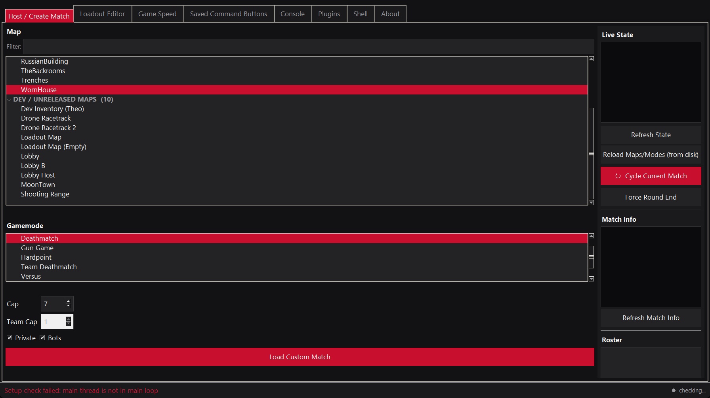
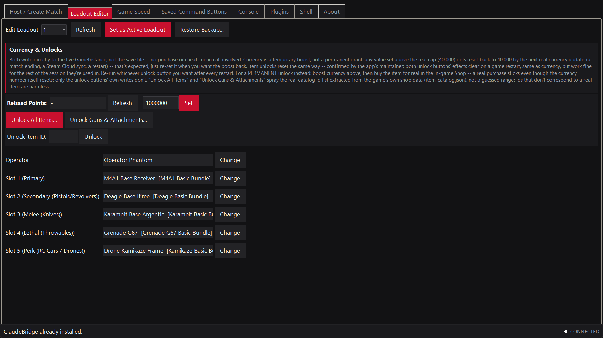
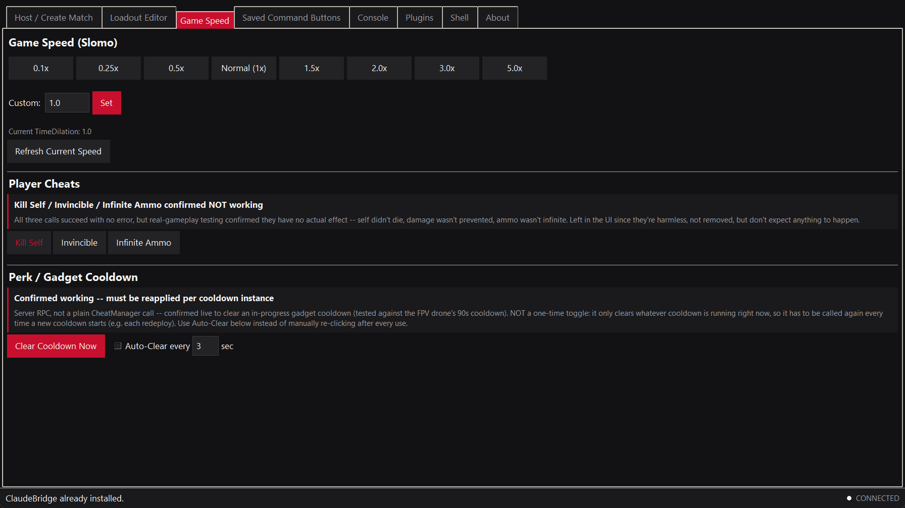

# Bodycam Overlay & Devkit

A standalone desktop control panel for **Bodycam** — **not injected into the
game process**. It's its own Python/Tkinter window that talks to a small
UE4SS Lua mod running inside the game over a file-based protocol; nothing
here hooks, patches, or reads the game's memory directly. Host matches, edit
loadouts, unlock cosmetics for the current session, and run Lua against the
live game from a Console tab.

It is **not** a general cheat menu for ranked/competitive play, and it does
not modify or affect other players — everything it does is scoped to your
own client and your own hosted matches. See **Disclaimer** below before
using it.



## Disclaimer

This is unofficial, third-party software, not affiliated with or endorsed by
Bodycam's developers or publisher. Use it against Bodycam's Terms of Service
and any anti-cheat policy at your own risk — the maintainers of this fork
take no responsibility for account action taken as a result of using it.
Everything here is self-only and local-only (loadouts, currency, cosmetics,
your own client's cheat menu); nothing sends data to or modifies any other
player. Use offline or in private/solo matches if you want to be sure.

## Requirements

- Windows 10/11
- Bodycam via Steam, run in **windowed or borderless** mode (a separate
  desktop window can't render on top of exclusive fullscreen)
- Python 3.13 — only if running from source; the packaged `.exe` needs
  nothing but Windows itself
- Git for Windows (Git Bash) — only if you use the **Shell** tab
- Administrator — only if the **Insert** hotkey doesn't register while the
  game has focus (a `keyboard`-library limitation on some systems)

## Install

**From a Release (recommended):**

1. Download `BodycamOverlayDevkit.exe` from the
   [latest Release](https://github.com/BiscuitDoesStuff/Bodycam-Overlay-Devkit/releases/latest).
2. Run it.
3. Press **Insert** to show the window. First launch deploys UE4SS +
   GameBridge into your Bodycam install automatically — **fully restart
   Bodycam once** afterward (a brand-new mod folder needs a real restart,
   not Ctrl+R).

**From source:**

```
pip install -r requirements.txt
start.bat
```

(`start.bat` just runs `python src/overlay_app.py` — path-independent, works
from any clone location.) The setup check above runs automatically on every
launch either way; there's no separate install script to run by hand.

## What it does

| Tab | What it does | Needs the game running? |
|---|---|---|
| Host / Create Match | Pick map + gamemode, set cap/team size, host, cycle the current match, force round end, live match state, weather/timer/round control | Yes |
| Loadout Editor | Edit any loadout slot from the live catalog, automatic backups; Currency & Unlocks panel (session-only boosts) | Yes (edits work offline too via the save file, but the item pickers need the game) |
| Game Speed | Slomo presets (8, 0.1x–5x) + custom value, Player Cheats (no-ops, kept for reference), Perk/Gadget Cooldown clear + Auto-Clear | Yes |
| Saved Command Buttons | Your own saved Console snippets as buttons, grouped by category, with Run All / import / export | Only when a button runs |
| Console | Raw Lua console into the live game process, saved history | Yes |
| Plugins | Load a shareable JSON "plugin" — a themed bundle of Console buttons — as its own sub-tab | Only when a button runs |
| Shell | Raw Bash on your own PC via Git Bash, unrelated to the game | No |
| About | Credits and license info | No |




Full detail on every tab, the Console/Plugin globals and file format, and
troubleshooting: **[docs/DOCUMENTATION.md](docs/DOCUMENTATION.md)**.

## How it works

A UE4SS Lua mod (`GameBridge`) runs inside the game and polls a temp
folder for requests; this app writes a request, the mod runs it on the
game's main thread, and writes back a response. One request at a time, file
names atomically renamed into place on both sides — no open port, no extra
dependency in the game process. See
**[docs/INTERNALS.md](docs/INTERNALS.md)** for the full protocol and every
non-obvious design decision behind the trickier parts of the source.

## Troubleshooting

- **"not responding" in the status bar** — check
  `%LOCALAPPDATA%\BodycamOverlayDevkit\overlay.log` first; it captures errors a
  `--windowed` build has no console to show.
- **Anything else, or the reset procedure** — see
  **[docs/DOCUMENTATION.md §6](docs/DOCUMENTATION.md#6-troubleshooting)**
  for the full list of causes.

## Contributing

Issues and pull requests are welcome. There's no CI or formal style guide
yet — keep changes focused, run `python tests/test_offline.py` before
submitting. Sharing a Saved Command
Button pack or Plugin? See **[community/](community)**.

## Credits & License

Original project created by **clutch5.9**. This fork, **Bodycam Overlay & Devkit**,
is maintained by **BiscuitDoesStuff**, **clutch5.9**, **ConocoFieldsForever** —
- [github.com/BiscuitDoesStuff/Bodycam-Overlay-Devkit](https://github.com/BiscuitDoesStuff/Bodycam-Overlay-Devkit)
- [https://github.com/CLUTCH5point9](https://github.com/CLUTCH5point9)
- [https://github.com/ConocoFieldsForever/BDT-Overlay-Fork](https://github.com/ConocoFieldsForever/BDT-Overlay-Fork)

[MIT](LICENSE) for this application's own code (everything under `src/`
except `src/ue4ss_bundle/`), original copyright preserved as the license
requires. Bundles a nightly build of
[RE-UE4SS](https://github.com/UE4SS-RE/RE-UE4SS) from its rolling
`experimental-latest` release channel (MIT-licensed separately, see
`src/ue4ss_bundle/ue4ss/LICENSE` for the vendored copy's own copyright) --
the DLL carries no embedded version resource, and `experimental-latest` is
a continuously-updated tag rather than a pinned release, so no more precise
version can be cited. Plugin files people write for the
Plugins tab are their own separate work — see
[docs/DOCUMENTATION.md §4.6](docs/DOCUMENTATION.md#46-licensing-of-plugin-files).
